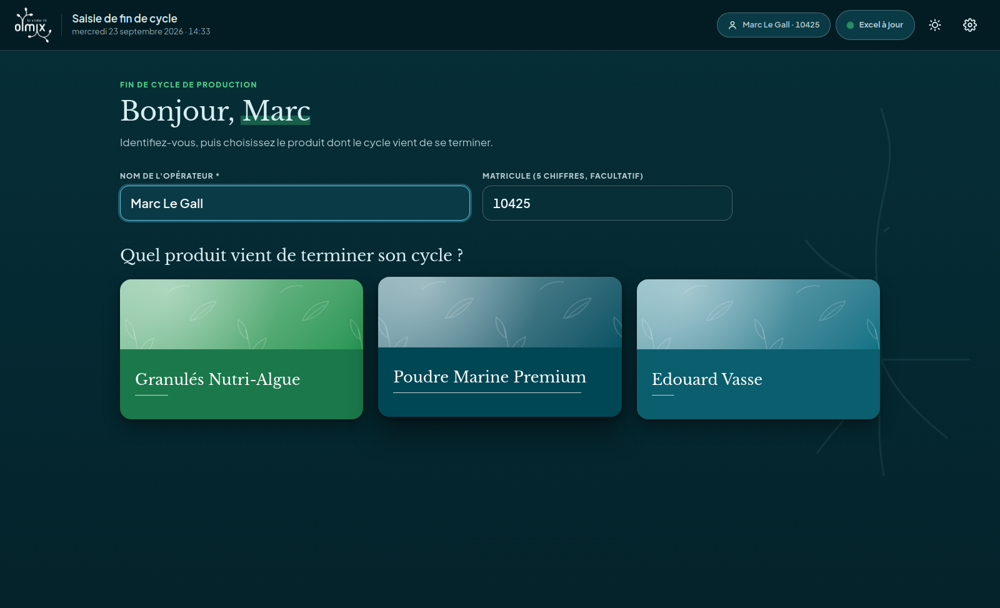
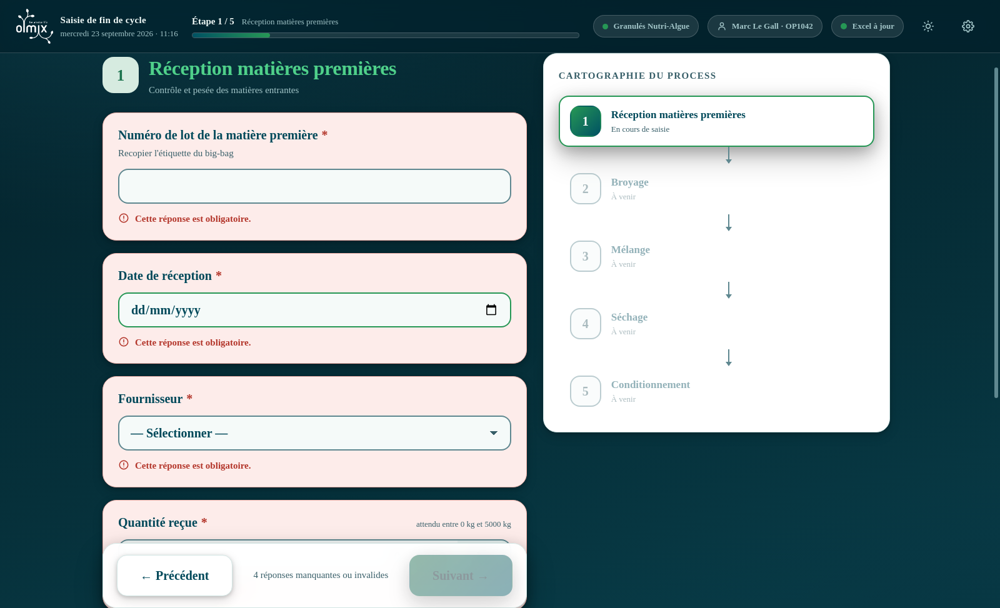
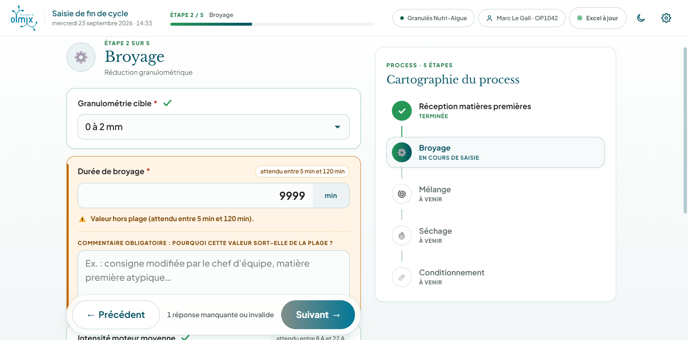
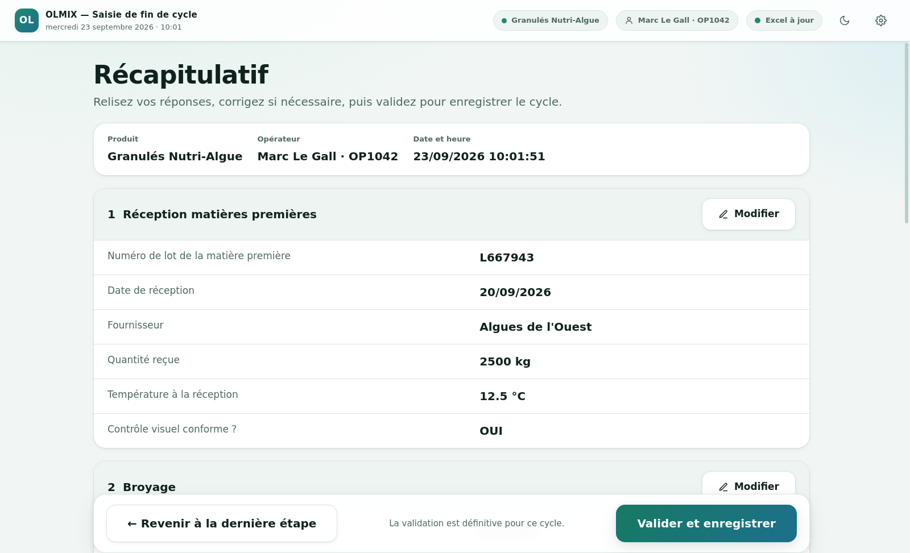
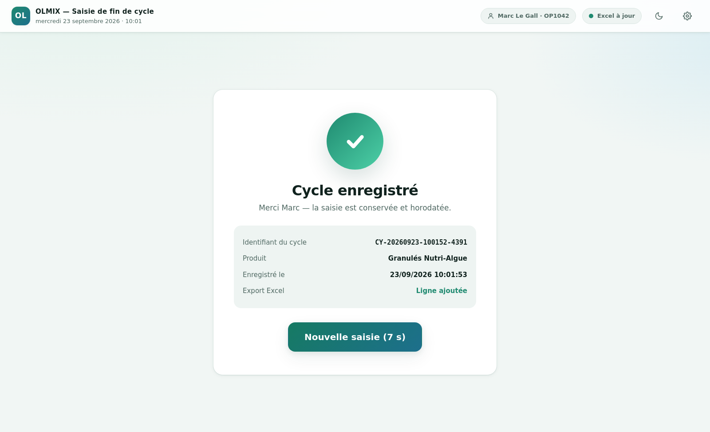
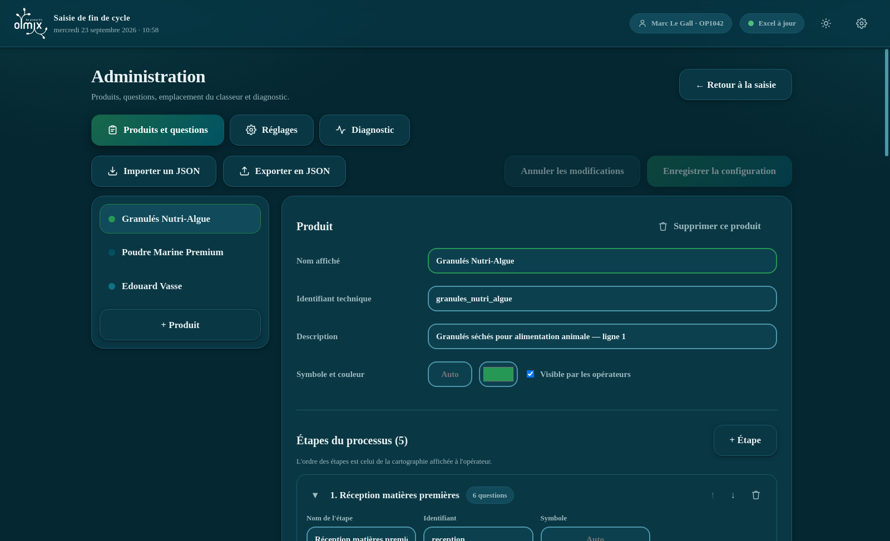

# Olmix — Saisie de fin de cycle de production

Application de bureau Windows destinée aux opérateurs de production du site de Bréhan.
À la fin de chaque cycle, l'opérateur s'identifie, choisit le produit, répond à une
succession de questions, relit son récapitulatif et valide. La saisie est alors
horodatée, stockée localement et **ajoutée automatiquement à un classeur Excel unique
et cumulatif**, directement exploitable par Power BI.

L'application fonctionne **entièrement hors connexion**. Aucun serveur, aucune base de
données distante.

---

## Sommaire

1. [Ce que fait l'application](#1-ce-que-fait-lapplication)
2. [Installation sur un poste atelier](#2-installation-sur-un-poste-atelier)
3. [Installation pour le développement](#3-installation-pour-le-développement)
4. [Fabriquer l'exécutable `.exe`](#4-fabriquer-lexécutable-exe)
5. [Parcours opérateur](#5-parcours-opérateur)
6. [Configurer les produits, étapes et questions](#6-configurer-les-produits-étapes-et-questions)
7. [Le classeur Excel](#7-le-classeur-excel)
8. [Connecter Power BI et automatiser l'actualisation](#8-connecter-power-bi-et-automatiser-lactualisation)
9. [Robustesse : file d'attente, brouillon, sauvegardes](#9-robustesse--file-dattente-brouillon-sauvegardes)
10. [Dépannage](#10-dépannage)
11. [Organisation du code](#11-organisation-du-code)
12. [Version web de démonstration](#12-version-web-de-démonstration)

---

## 1. Ce que fait l'application

| Besoin | Réponse apportée |
|---|---|
| Saisie rapide en atelier | Gros boutons, grande police, fort contraste, utilisable au doigt |
| Aucun produit codé en dur | Tout vient d'un fichier JSON, éditable à la main ou via le mode administrateur |
| Contrôle de cohérence | Champs obligatoires bloquants, bornes min/max avec alerte orange et commentaire exigé |
| Aucune perte de données | Brouillon auto-sauvegardé, stockage local, file d'attente, sauvegarde quotidienne |
| Exploitation Power BI | Un seul classeur cumulatif, Tableaux Excel nommés, types de données propres |

---

## 2. Installation sur un poste atelier

1. Copier `Olmix-Saisie-Production-1.0.0-x64.exe` sur le poste et l'exécuter.
   L'installation se fait **pour l'utilisateur courant** : aucun droit administrateur
   Windows n'est nécessaire.
2. Lancer **Saisie Production** depuis le bureau ou le menu Démarrer.
3. Au premier démarrage, l'application crée son dossier de données et y copie la
   configuration produits d'exemple.
4. Ouvrir le **mode administrateur** (icône ⚙️ en haut à droite, mot de passe initial
   `olmix`) puis :
   - onglet **Réglages** → définir le chemin du classeur Excel (dossier réseau, OneDrive
     ou SharePoint synchronisé) ;
   - onglet **Réglages** → section Sécurité → **changer le mot de passe** ;
   - onglet **Produits et questions** → adapter les produits et les questions.

> Une version *portable* (`…-portable.exe`) est également produite : elle s'exécute sans
> installation, utile pour tester sur un poste avant déploiement.

### Emplacements utilisés

| Contenu | Chemin |
|---|---|
| Configuration produits | `%APPDATA%\olmix-saisie-production\config\produits.json` |
| Réglages | `%APPDATA%\olmix-saisie-production\reglages.json` |
| Saisies enregistrées | `%APPDATA%\olmix-saisie-production\cycles\AAAA-MM.json` |
| File d'attente Excel | `%APPDATA%\olmix-saisie-production\file-attente.json` |
| Sauvegardes du classeur | `%APPDATA%\olmix-saisie-production\sauvegardes\` |
| Journal | `%APPDATA%\olmix-saisie-production\journal.log` |
| Classeur Excel | **configurable**, par défaut `Documents\Olmix\Saisies_Production.xlsx` |

Rien n'est écrit dans le dossier d'installation : une mise à jour de l'application
n'écrase jamais la configuration de l'atelier.

---

## 3. Installation pour le développement

Prérequis : **Node.js 20 ou plus** ([nodejs.org](https://nodejs.org), version LTS).

### Le plus simple : depuis l'Explorateur Windows

Deux fichiers sont fournis à la racine du projet, à **double-cliquer** :

| Fichier | Effet |
|---|---|
| `Lancer-application.bat` | installe les dépendances au premier lancement, puis démarre l'application |
| `Creer-executable.bat` | fabrique l'installeur `.exe` dans `release\` et ouvre le dossier |

Une fenêtre noire s'ouvre et reste ouverte pendant l'utilisation : la fermer arrête
l'application.

> Windows peut afficher « Windows a protégé votre ordinateur » au premier double-clic
> sur un `.bat` provenant d'un téléchargement. Cliquer sur **Informations
> complémentaires** puis **Exécuter quand même**.

### En ligne de commande

Depuis l'Explorateur : ouvrir le dossier du projet, cliquer dans la **barre d'adresse**,
taper `cmd` et valider — l'invite de commandes s'ouvre déjà positionnée dans le dossier.
Puis :

```bash
npm install          # installe les dépendances
npm run dev          # Vite + processus principal + Electron, avec rechargement à chaud
```

Autres commandes :

```bash
npm run typecheck      # vérification TypeScript
npm run build          # compile l'interface et le processus principal dans dist/
npm test               # test de bout en bout : lance vraiment l'application et vérifie le classeur produit
npm run exemple:excel  # régénère exemples/Saisies_Production_exemple.xlsx
```

`npm test` démarre une instance réelle d'Electron dans un dossier temporaire, soumet des
cycles via l'API exposée à l'interface, puis relit le `.xlsx` obtenu. Il couvre la
création du classeur, l'ajout automatique de colonnes, le rejet d'une saisie incomplète,
le cas « classeur verrouillé par Excel », la déduplication, le brouillon et le verrouillage
du mode administrateur.

---

## 4. Fabriquer l'exécutable `.exe`

> **Node.js n'est nécessaire que pour fabriquer l'exécutable, jamais pour l'utiliser.**
> L'installeur produit embarque son propre moteur : le poste de l'atelier qui l'installe
> n'a besoin ni de Node.js, ni de droits administrateur.

### Sans rien installer : laisser GitHub le fabriquer

C'est la voie à suivre lorsqu'on ne peut pas installer Node.js sur son poste. La
fabrication a lieu sur une machine Windows fournie par GitHub
([`.github/workflows/executable-windows.yml`](.github/workflows/executable-windows.yml)).

1. Sur le dépôt GitHub, onglet **Actions**.
2. Dans la colonne de gauche, **Executable Windows**.
3. Bouton **Run workflow**, choisir la branche, confirmer.
4. Attendre la coche verte (compter 5 à 10 minutes).
5. Cliquer sur l'exécution terminée, puis, tout en bas, télécharger l'artefact
   **Olmix-Saisie-Production-Windows**.
6. **Décompresser le `.zip` obtenu** — GitHub distribue toujours les artefacts sous
   cette forme — puis lancer le `.exe`.

Pour obtenir les `.exe` en téléchargement direct, sans `.zip` : pousser une étiquette de
version (`git tag v1.0.0 && git push origin v1.0.0`). Le même workflow les attache alors
à une **Release**, d'où ils se téléchargent d'un clic.

### En local, depuis Windows

```bash
npm run dist              # installeur NSIS + version portable, dans release/
npm run dist:portable     # version portable seule
```

Ou, sans ligne de commande, double-clic sur `Creer-executable.bat`.

La compilation doit être lancée **depuis Windows** (ou depuis Linux/macOS avec Wine
installé) : `electron-builder` a besoin des outils Windows pour signer et empaqueter
l'installeur NSIS. Les fichiers produits arrivent dans `release/`.

Pour signer l'exécutable avec un certificat d'entreprise, ajouter dans
`electron-builder.yml` :

```yaml
win:
  certificateFile: chemin/vers/certificat.pfx
  certificatePassword: ${env.CERT_PASSWORD}
```

---

## 5. Parcours opérateur

1. **Accueil** — nom (obligatoire) et matricule (facultatif), puis choix du produit
   parmi des cartes visuelles. Une barre de recherche apparaît au-delà de 4 produits.
2. **Formulaire** — une page par étape du processus.
   - À gauche (≈ 55 %) : les questions de l'étape.
   - À droite (≈ 45 %) : la cartographie du processus. L'étape en cours est mise en
     surbrillance et animée, les étapes terminées portent une coche verte, les suivantes
     sont grisées. Les étapes déjà parcourues sont cliquables.
   - En haut : progression « Étape X / N », produit, opérateur, date et heure.
   - **Entrée** passe à l'étape suivante (sauf dans une zone de texte long).
3. **Récapitulatif** — toutes les réponses, regroupées par étape, avec un bouton
   « Modifier » par étape.
4. **Confirmation** — animation de succès, identifiant du cycle, état de l'export, puis
   retour automatique à l'accueil au bout de 8 secondes.

### Règles de saisie

- **Champ obligatoire vide** → bouton « Suivant » inactif, et un clic dessus surligne en
  rouge les champs fautifs en amenant le premier sous les yeux.
- **Valeur hors bornes min/max** → le champ vire à l'**orange**, un message indique la
  plage attendue et un **commentaire est exigé**. La saisie n'est jamais bloquée pour
  autant : une fois le commentaire écrit, on peut continuer. Le commentaire part dans
  l'export.
- **« Précédent »** est toujours disponible ; aucune réponse déjà saisie n'est perdue.
- La virgule est acceptée comme séparateur décimal ; la cellule Excel reçoit un vrai
  nombre.

---

## 6. Configurer les produits, étapes et questions

Deux voies équivalentes, qui écrivent le même fichier :

- **Mode administrateur** (⚙️ → mot de passe) : ajout/modification/suppression de
  produits, d'étapes et de questions, réordonnancement, import/export du JSON. Chaque
  enregistrement archive la version précédente dans
  `%APPDATA%\olmix-saisie-production\config\historique\`.
- **Édition directe** de `produits.json` (l'application le recharge au démarrage ; le
  bouton « Recharger » du bandeau d'erreur permet aussi de le faire à chaud).

Le fichier d'exemple livré est [`config/produits.example.json`](config/produits.example.json) :
3 produits fictifs de 4 à 5 étapes (réception matières premières, broyage, mélange,
séchage, conditionnement). Le troisième, **Edouard Vasse**, est un produit de
démonstration : supprimez-le, ou renommez-le pour en faire votre premier vrai produit.

### Structure du JSON

```jsonc
{
  "version": 1,
  "produits": [
    {
      "id": "granules_nutri_algue",   // minuscules, chiffres, tirets bas
      "nom": "Granulés Nutri-Algue",
      "description": "Ligne 1",
      "couleur": "#1F8A70",            // accent de la carte et de la cartographie
      "icone": "🌿",
      "actif": true,                   // false = masqué aux opérateurs, conservé
      "etapes": [
        {
          "id": "reception",
          "nom": "Réception matières premières",
          "description": "Contrôle et pesée",
          "icone": "📦",
          "questions": [
            {
              "id": "quantite_recue",            // unique dans le produit
              "colonne": "Quantite_Recue_kg",    // en-tête Excel — voir encadré
              "libelle": "Quantité reçue",
              "aide": "Lecture sur le pont-bascule",
              "type": "nombre",
              "obligatoire": true,
              "unite": "kg",
              "min": 0,
              "max": 5000,
              "decimales": 1,
              "options": [],
              "defaut": null,
              "commentaireSiHorsBornes": true
            }
          ]
        }
      ]
    }
  ]
}
```

> **`colonne` est volontairement distinct de `libelle`.**
> `libelle` est la question lue par l'opérateur ; `colonne` est l'en-tête écrit dans
> Excel, celui que Power BI référence. Vous pouvez donc reformuler une question sans
> casser l'historique ni les mesures Power BI. À l'inverse, **renommer `colonne` crée une
> nouvelle colonne** et laisse l'ancienne en place.

### Types de questions

| `type` | Saisie affichée | Valeur écrite dans Excel |
|---|---|---|
| `texte` | champ d'une ligne | texte |
| `textarea` | zone multiligne | texte |
| `nombre` | champ numérique + unité affichée à côté | **nombre** (jamais l'unité) |
| `booleen` | deux gros boutons Oui / Non | `OUI` / `NON` |
| `liste` | liste déroulante | **libellé** de l'option |
| `choix_multiple` | cases à cocher | libellés séparés par ` \| ` |
| `date` | sélecteur de date | **date** |
| `heure` | sélecteur d'heure | texte `HH:MM` |
| `datetime` | date + heure | **date/heure** |

Propriétés communes : `obligatoire`, `aide`, `defaut`.
Propriétés réservées au type `nombre` : `unite`, `min`, `max`, `decimales`,
`commentaireSiHorsBornes`.
Propriétés réservées à `liste` et `choix_multiple` : `options`
(`[{ "valeur": "CODE", "libelle": "Texte affiché" }]`).

### Contrôles appliqués à l'enregistrement

Une configuration invalide est **refusée** avec un message précis :

- identifiant de produit, d'étape ou de question en double ;
- `min` supérieur à `max` ;
- `liste` / `choix_multiple` sans option ;
- `min`/`max` sur un type non numérique ;
- **même colonne Excel utilisée avec deux types différents** (Power BI se retrouverait
  avec une colonne de type mixte).

Un simple *avertissement* est émis si deux produits partagent une colonne avec des
unités différentes. Partager délibérément une colonne entre deux produits (par exemple
`Temperature_Sechage_C`) est au contraire **recommandé** : c'est ce qui permet de les
comparer sur un même indicateur.

---

## 7. Le classeur Excel

Un **seul fichier**, enrichi cycle après cycle. Emplacement configurable dans le mode
administrateur : dossier local, partage réseau, OneDrive ou SharePoint synchronisé.

Un exemple pré-rempli de 8 cycles fictifs est livré :
[`exemples/Saisies_Production_exemple.xlsx`](exemples/Saisies_Production_exemple.xlsx).

### Trois feuilles, trois Tableaux nommés

| Feuille | Tableau | Grain | Usage |
|---|---|---|---|
| `Saisies` | `T_Saisies` | 1 ligne = 1 cycle | table de faits « large » |
| `Reponses` | `T_Reponses` | 1 ligne = 1 réponse | table de faits « longue », comparaison inter-produits |
| `Catalogue` | `T_Questions` | 1 ligne = 1 question | table de dimension (étape, unité, bornes) |

**`T_Saisies`** — colonnes fixes puis une colonne par question :

`ID_Cycle`, `Date`, `Heure`, `Date_Heure`, `Operateur`, `Matricule`, `Produit`,
`Produit_ID`, `Duree_Saisie_min`, `Nb_Alertes`, `Alertes`, puis `Lot_Matiere_Premiere`,
`Quantite_Recue_kg`, `Temperature_Sechage_C`, …

Une question absente du produit saisi laisse simplement la cellule vide.

**`T_Reponses`** — format long, idéal pour comparer des produits n'ayant pas les mêmes
questions :

`ID_Cycle`, `Date`, `Heure`, `Operateur`, `Matricule`, `Produit`, `Produit_ID`,
`Etape_Ordre`, `Etape`, `Question_ID`, `Cle_Question`, `Question`, `Colonne`, `Type`,
`Valeur_Texte`, `Valeur_Code`, `Valeur_Num`, `Unite`, `Hors_Bornes`, `Commentaire`.

**`T_Questions`** — catalogue :

`Cle_Question`, `Produit_ID`, `Produit`, `Etape_Ordre`, `Etape_ID`, `Etape`,
`Question_ID`, `Colonne`, `Libelle`, `Type`, `Obligatoire`, `Unite`, `Min`, `Max`.

### Garanties de structure

- Une **seule ligne d'en-tête**, aucune cellule fusionnée, **aucune ligne vide**.
- En-têtes **sans accent ni caractère spécial** (`Temperature_Sechage_C`).
- Les dates sont de vraies **dates Excel**, les nombres de vrais **nombres** (sans unité
  dans la cellule, donc aucun problème de séparateur décimal), les cases à cocher des
  `OUI` / `NON`.
- **Ajouter une question dans la configuration crée automatiquement la colonne
  correspondante**, à droite des colonnes existantes, sans toucher aux lignes déjà
  écrites ni réordonner quoi que ce soit.
- Un même `ID_Cycle` n'est jamais écrit deux fois : rejouer la file d'attente ne crée
  aucun doublon.
- L'écriture passe par un fichier temporaire suivi d'un renommage : une coupure en cours
  d'écriture laisse le classeur intact.

> **Le classeur est un export, pas un classeur de travail.**
> Il est relu et réécrit à chaque validation. Mise en forme, filtres et colonnes ajoutées
> à la main sont conservés dans la mesure du possible, mais les objets Excel avancés
> (graphiques, tableaux croisés dynamiques, macros) ne survivent pas à la réécriture.
> Construisez vos analyses **dans Power BI ou dans un classeur séparé** qui pointe vers
> celui-ci.

---

## 8. Connecter Power BI et automatiser l'actualisation

### Première connexion (Power BI Desktop)

1. **Accueil → Obtenir les données → Classeur Excel**.
2. Sélectionner le classeur (`Saisies_Production.xlsx`).
3. Dans le Navigateur, cocher **`T_Saisies`, `T_Reponses` et `T_Questions`** — les
   entrées avec une icône de **tableau**, *pas* les feuilles du même nom.
   C'est le point déterminant : un Tableau nommé possède une plage dynamique, donc les
   lignes ajoutées après coup sont reprises automatiquement. Une feuille entière obligerait
   à redéfinir la plage à chaque fois.
4. **Charger** (ou **Transformer les données** pour vérifier les types).

### Relations à créer

| De | Vers | Cardinalité |
|---|---|---|
| `T_Reponses[ID_Cycle]` | `T_Saisies[ID_Cycle]` | plusieurs à un |
| `T_Reponses[Cle_Question]` | `T_Questions[Cle_Question]` | plusieurs à un |

Vous obtenez un modèle en étoile immédiatement exploitable : filtrer par étape, par
produit ou par question, et comparer deux produits sur `Valeur_Num`.

### Actualisation automatique

**Cas 1 — classeur dans OneDrive Entreprise ou SharePoint (recommandé).**
Aucune passerelle n'est nécessaire.

1. Dans la bibliothèque SharePoint / OneDrive en ligne, copier le lien du fichier et
   retirer le suffixe `?web=1`.
2. Dans Power BI Desktop : **Obtenir les données → Web**, coller ce lien
   (ou **SharePoint Folder** pour toute une bibliothèque).
3. Publier le rapport dans le service Power BI.
4. **Jeux de données → Paramètres → Informations d'identification de la source de
   données** → se connecter en OAuth2.
5. **Actualisation planifiée** → activer, choisir la fréquence (jusqu'à 8 fois par jour
   en Pro, 48 en Premium) et les horaires.

**Cas 2 — classeur sur un partage réseau (`\\serveur\partage\...`).**
Une **passerelle de données locale** (*On-premises data gateway*) est obligatoire.

1. Installer la passerelle en mode standard sur un poste ou serveur allumé en
   permanence, ayant accès au partage.
2. Dans le service Power BI : **Paramètres → Gérer les passerelles → Ajouter une source
   de données** (type *File*), chemin **exactement identique** à celui du rapport
   (chemin UNC, pas une lettre de lecteur), avec un compte Windows autorisé en lecture.
3. Associer le jeu de données à cette passerelle, puis configurer l'actualisation
   planifiée.

**À savoir**

- Chemin **UNC** obligatoire (`\\serveur\partage\Olmix\Saisies_Production.xlsx`) :
  une lettre de lecteur n'existe pas côté passerelle.
- **Laisser le classeur ouvert dans Excel bloque son écriture.** L'application le
  détecte, met la saisie en file d'attente et l'écrit dès la fermeture — mais autant
  prendre l'habitude de le refermer.
- Le rapport peut pointer vers `T_Saisies` **et** `T_Reponses` : la feuille large est la
  plus lisible produit par produit, la feuille longue la plus commode pour comparer des
  produits aux questions différentes.

---

## 9. Robustesse : file d'attente, brouillon, sauvegardes

**Brouillon.** Chaque modification de champ est sauvegardée un demi-seconde plus tard.
En cas de fermeture accidentelle ou de coupure, l'accueil propose de reprendre la saisie
exactement là où elle s'était arrêtée. Un brouillon de plus de 24 h est ignoré.

**File d'attente Excel.** Une saisie validée est **toujours** enregistrée localement
d'abord, puis écrite dans le classeur. Si le fichier est verrouillé (ouvert dans Excel,
partage réseau momentanément coupé, OneDrive en cours de synchronisation) :

- la saisie est conservée en file d'attente ;
- l'indicateur en haut à droite passe à l'orange et affiche le nombre de saisies en
  attente ; un clic dessus force une nouvelle tentative ;
- une nouvelle tentative est faite automatiquement toutes les 20 secondes (délai
  réglable), et au démarrage suivant de l'application ;
- l'opérateur n'a **rien** à refaire.

**Sauvegarde quotidienne.** Avant la première écriture de la journée, une copie datée du
classeur est déposée dans `sauvegardes\`. Les copies plus anciennes que la durée de
rétention configurée (30 jours par défaut) sont supprimées.

**Stockage local.** Les cycles sont conservés dans `cycles\AAAA-MM.json`. Le classeur
Excel peut être supprimé, déplacé ou recréé : les saisies restent disponibles.

---

## 10. Dépannage

| Symptôme | Cause et solution |
|---|---|
| Bandeau rouge « Configuration inutilisable » | JSON mal formé ou règle enfreinte. Le message donne la ligne fautive. Corriger `produits.json` puis cliquer sur **Recharger**. |
| Indicateur orange « N en attente » | Le classeur est verrouillé. Le refermer dans Excel, ou vérifier l'accès au dossier réseau. L'écriture repart seule. |
| Indicateur rouge « Erreur Excel » | Dossier inexistant ou droits insuffisants. Voir le message dans ⚙️ → Diagnostic, puis corriger le chemin dans Réglages. |
| Power BI ne voit pas les nouvelles lignes | La source pointe sur la *feuille* et non sur le *Tableau*. Refaire la connexion en sélectionnant `T_Saisies`. |
| Une colonne est apparue en double | `colonne` a été renommée dans la configuration. Rétablir l'ancien nom, ou fusionner les deux colonnes côté Power BI. |
| Mot de passe administrateur oublié | Supprimer `reglages.json` dans le dossier de données : le mot de passe revient à `olmix`. Le chemin du classeur devra être redéfini. |
| L'application ne démarre pas | Consulter `journal.log` dans le dossier de données. |

---

## 11. Organisation du code

```
electron/                    Processus principal (Node — seul à toucher le disque)
  main.ts                    Fenêtre, cycle de vie, politique de sécurité
  preload.ts                 Pont contextIsolation → window.olmix
  ipc.ts                     Canaux IPC, garde-fou du mode administrateur
  services/
    config.service.ts        Chargement, validation et archivage de la configuration
    settings.service.ts      Réglages + mot de passe administrateur (scrypt)
    store.service.ts         Stockage local des cycles
    draft.service.ts         Brouillon de saisie
    excel.service.ts         Écriture incrémentale dans le classeur
    queue.service.ts         File d'attente et reprise automatique
    backup.service.ts        Sauvegarde quotidienne et purge
    fs-utils.ts              Écritures atomiques, détection de verrou
    logger.ts, paths.ts

shared/                      Code partagé interface ↔ processus principal
  types.ts                   Modèle de données
  schema.ts                  Validation Zod de la configuration
  columns.ts                 Dérivation et normalisation des en-têtes Excel
  validation.ts              Règles de saisie (obligatoire, bornes, commentaire)
  cycle.ts                   Construction d'un cycle depuis la configuration
  api.ts                     Contrat de l'API exposée à l'interface

src/                         Interface React
  App.tsx                    Orchestration, thème, transitions
  screens/                   Accueil, Formulaire, Récapitulatif, Confirmation, Admin
  components/                Cartographie, barre supérieure, indicateur de sync, champs
  state/useSession.ts        État de la saisie en cours
  styles/tokens.css          Palette et typographie — un seul fichier à modifier

Lancer-application.bat       Double-clic : installe si besoin, puis démarre
Creer-executable.bat         Double-clic : fabrique l'installeur .exe
config/produits.example.json Configuration d'exemple (2 produits)
exemples/                    Classeur Excel d'exemple pré-rempli
scripts/                     Build du processus principal, test e2e, générateurs
.github/workflows/           Fabrication de l'exécutable Windows par GitHub
```

Les règles de saisie de `shared/validation.ts` sont appliquées **deux fois** : par
l'interface pour le retour immédiat, et par le processus principal avant écriture. Une
saisie invalide ne peut donc pas atteindre le classeur, même si l'interface était
contournée.

---

## Aperçu

Captures réalisées automatiquement par `node scripts/captures.mjs`, qui démarre
l'application et la parcourt comme le ferait un opérateur.

| | |
|---|---|
|  |  |
| *Accueil : identification et choix du produit* | *Blocage : les réponses manquantes sont surlignées* |
|  |  |
| *Valeur hors plage : alerte orange et commentaire exigé* | *Récapitulatif, modifiable étape par étape* |
|  |  |
| *Confirmation horodatée et état de l'export* | *Mode administrateur, thème sombre* |

---

## 12. Version web de démonstration

L'application peut aussi être publiée sur le web, pour être **montrée** sans rien
installer : une URL suffit, et plusieurs personnes peuvent la parcourir en parallèle.

> **C'est une vitrine, pas le poste de production.** Les cycles validés restent dans le
> navigateur du visiteur, aucun classeur Excel n'est alimenté, et rien n'est partagé
> entre visiteurs. Un bandeau le rappelle à l'écran. La version installée en atelier
> reste la seule qui écrive dans le classeur et fonctionne hors connexion.

### Comment cela fonctionne

Dans l'application de bureau, `electron/preload.ts` pose `window.olmix` et toutes les
opérations passent par le processus principal, seul à toucher le disque. Dans un
navigateur ce pont n'existe pas : [`src/lib/apiWeb.ts`](src/lib/apiWeb.ts) réimplémente
la même surface d'API sur le stockage local. `src/main.tsx` l'installe uniquement
lorsque `window.olmix` est absent — l'application de bureau n'est donc pas affectée.

Les règles métier, elles, ne sont pas simulées : validation de la configuration,
contrôle des réponses et construction des cycles viennent de `shared/`, exactement comme
sur le poste réel. Ce que l'on essaie en ligne se comporte comme ce que l'atelier
utilisera.

| Fonctionne en ligne | Ne fonctionne pas en ligne |
|---|---|
| Parcours opérateur complet, des 5 écrans | Écriture du classeur Excel cumulatif |
| Champs obligatoires, bornes min/max, commentaire exigé | File d'attente et reprise automatique |
| Cartographie du process, thèmes clair et sombre | Sauvegardes quotidiennes |
| Mode administrateur, édition des produits et questions | Ouverture de dossiers du poste |
| Brouillon, reprise d'une saisie interrompue | Fonctionnement hors connexion |

### Déployer sur Vercel

Aucun outil local n'est nécessaire : Vercel compile lui-même depuis GitHub.

1. Sur [vercel.com](https://vercel.com), se connecter **avec son compte GitHub**.
2. **Add New… → Project**, puis importer le dépôt `olmix`.
3. Laisser les réglages proposés : ils sont lus dans
   [`vercel.json`](vercel.json) (commande `npm run build:web`, sortie `dist/renderer`).
4. **Deploy**, puis attendre une à deux minutes.

> **Vérifier la branche déployée.** Vercel publie la *branche par défaut* du dépôt, pas
> celle sur laquelle on vient de travailler. Si la page affiche une erreur alors que la
> compilation réussit en local, c'est presque toujours cela : Vercel déploie une branche
> dépourvue de `vercel.json`, cherche le résultat dans `dist/` au lieu de
> `dist/renderer`, et ne trouve rien. Cela se règle dans **Settings → Git → Production
> Branch**, ou en changeant la branche par défaut du dépôt sur GitHub.

L'URL obtenue (`https://…vercel.app`) est publique et se partage telle quelle. Chaque
poussée sur la branche redéploie automatiquement.

Pour compiler la vitrine en local, si Node.js est disponible : `npm run build:web`,
puis servir le dossier `dist/renderer`.
